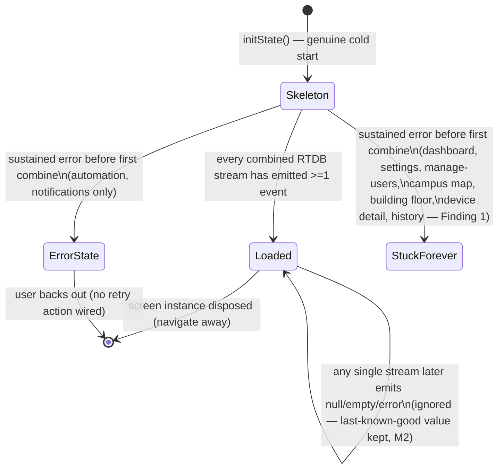

# Work Summary — Dynamic Skeleton Loading (Retrospective Spec)

Date: 2026-09-09
Author: Joren (systems/business analyst) — written **after** the feature
shipped, at the requester's request, to backfill the requirements pass that
didn't happen before mobile (don) and web (rhose) built this. Nothing in
this document should be read as new scope; it documents what was actually
built, what a spec would have said up front, and what's ambiguous now.

Related prior docs: [WORK_SUMMARY.md](WORK_SUMMARY.md) (web dashboard
parity), [WORK_SUMMARY_2026-09-03.md](WORK_SUMMARY_2026-09-03.md) (role
model — relevant here because Settings/Manage Users' RTDB reads are the same
role-gated paths described in its §4).

---

## 1. As-is problem (root cause, confirmed against code)

Every screen that reads RTDB manages its own `.onValue` listener(s) directly
in a `StatefulWidget`. Before this fix, each listener's callback treated
`snapshot.value == null` (or a non-`Map` value) as "there is no data" and
reset that field to empty/zero unconditionally — including on a stream
**rebuild** (drag/relayout, brief lag, reconnect after a network blip)
where the transient event was a resend, not a real data-loss. On any of
those screens, whichever field was tied to the listener that hiccupped
would flash to blank/0 until the next real event arrived, even though nothing
about the underlying data had changed.

## 2. User story

> As a faculty/admin user viewing any data screen in the app (dashboard,
> building floor, device detail, history, automation, campus map,
> notifications, settings, manage users), I want the numbers and lists I'm
> already looking at to stay stable through normal network hiccups (weak
> wifi, screen rotation, backgrounding/foregrounding), so that I don't
> mistake a rendering glitch for a real device going offline or a reading
> resetting to zero.

## 3. What was actually built (confirmed by reading the code, not the task description)

- `lib/widgets/screen_skeleton.dart` — `ScreenSkeleton` wraps content in
  `Skeletonizer` with a shimmer using `AppColors.greenPale` as base and a
  60%-white-lerp of it as highlight. Zero effect when `isLoading: false`.
- `lib/utils/placeholder_data.dart` — plain `Map<String, dynamic>` builders
  (`placeholderBuilding`, `placeholderDevice`, `placeholderHistoryEntry`,
  `placeholderNotification`, `placeholderUser`, and `*List()` variants),
  matching the rest of the codebase's map-everywhere convention (no model
  classes exist for these entities).
- `AutomationSchedule.placeholder()`/`.placeholderList()` in
  `lib/screens/automation_screen.dart` and `WebAutomationSchedule` equivalents
  in `automation_screen_web.dart` — additive factories, same pattern.
- Per-screen pattern (verified in `dashboard_screen.dart`,
  `dashboard_viewmodel.dart`, `settings_screen(.dart/_web)`,
  `manage_users_screen.dart`, `campus_map_screen.dart`,
  `building_floor_screen(.dart/_web)`, `device_detail_screen(.dart/_web)`,
  `history_screen(.dart/_web)`, `automation_screen(.dart/_web)`,
  `notifications_screen(.dart/_web)` — 18 files, 9 logical screens):
  `Rx.combineLatestList<DatabaseEvent>([...])` merges every RTDB ref the
  screen depends on into one subscription. Inside the combined handler,
  each field only resets to empty/default **while `_isLoading`/`_loading`
  is still true**; once it flips to `false` (all streams have emitted at
  least once), a later null/non-Map snapshot on any one path is silently
  skipped and the last-known-good value is kept. `_isLoading` is
  per-`State`-instance and never reset back to `true` except by a fresh
  `initState()` (a genuine new screen instance).
- The dashboard notification badge got the same treatment independently
  via a `_notificationsLoadedOnce` guard in `dashboard_screen.dart` — this
  was a pre-existing instance of the identical bug class, folded into the
  same pass.

## 4. Acceptance criteria (MoSCoW) — what should have been signed off before build

**Must**
- [M1] Every screen listed in §3 shows `ScreenSkeleton` (shimmer, app palette)
  with representative placeholder content instead of a blank/zero UI on
  first load, until all of that screen's RTDB dependencies have delivered
  at least one snapshot.
- [M2] Once a screen instance has shown real data, a transient null/empty
  snapshot on any single combined stream must never revert already-displayed
  values to blank/zero, nor bring the skeleton back, for the lifetime of that
  screen instance.
- [M3] The dashboard unread-notification badge must not reset to 0 on a
  transient null snapshot (this was a live, user-visible instance of the
  same bug class, correctly folded into this fix rather than filed
  separately).
- [M4] Re-entering a screen via a genuine cold start (new route push /
  fresh login) must show the skeleton again — "sticky" only applies within
  one screen instance's life, not forever.

**Should**
- [S1] A sustained failure to ever complete the first combined load
  (permission-denied, malformed data throwing before `isLoading` flips,
  offline with no reconnect) should surface a distinguishable error/retry
  state instead of leaving the skeleton spinning indefinitely — see §6,
  Finding 1: this is currently true for only 2 of 9 screens.
- [S2] Placeholder record counts/shapes should resemble typical real data
  (e.g. 4 buildings, 6 devices, 7 history rows) so the layout doesn't
  visibly jump in size once real data replaces the shimmer.
- [S3] Settings and Manage Users, since explicitly pulled into scope
  mid-task, should get the identical contract (M1/M2/S1) as the other 7
  screens, not a lighter version — confirmed true for M1/M2 in the code
  read; **not** true for S1 (see Finding 1).

**Could**
- [C1] A configurable maximum skeleton duration (e.g. 15–20s) after which a
  "still trying / check your connection" affordance appears without
  treating it as a hard error — layered on top of S1, not a replacement.
- [C2] Lightweight logging of "time to first combined emission" per screen,
  to catch slow paths in production before users complain.

**Won't (explicitly out of scope for this pass)**
- [W1] No changes to `database.rules.json` / per-path permission scoping.
- [W2] No new model classes for devices/buildings/history/etc. — placeholders
  intentionally stay map-shaped to match the existing convention.
- [W3] No retrofit of the loading-gate pattern onto screens/dialogs that
  don't read RTDB directly.

## 5. Data dictionary — placeholder shapes (`lib/utils/placeholder_data.dart`)

| Builder | Mirrors RTDB path | Fields | Notes |
|---|---|---|---|
| `placeholderBuilding` / `placeholderBuildingList` | `buildings/{code}` | `code, name, floors` | Default list count 4 |
| `placeholderDevice` / `placeholderDeviceList` | `devices/{id}`, `master_devices/{id}` | `device_id, utility, building, room, floor, relay, power, kwh, assignedTo, last_seen` | Superset of fields read across dashboard/building-floor/device-detail; default list count 6 |
| `placeholderHistoryEntry` / `placeholderHistoryList` | `history/*` (daily/weekly/monthly/yearly rows) | `label, kwh, cost` | Default list count 7 |
| `placeholderNotification` / `placeholderNotificationList` | `notifications/{id}` | `id, type, message, building, deviceId, timestamp` | Default list count 5 |
| `placeholderUser` / `placeholderUserList` | `users/{uid}` | `uid, name, email, role, institute` | Default list count 5 |

Plus, additive to existing files (not in `placeholder_data.dart`):

| Factory | File | Fields |
|---|---|---|
| `AutomationSchedule.placeholder()` / `.placeholderList()` | `lib/screens/automation_screen.dart` | `id, name, scope, target, utility, onTime, offTime, days, enabled` |
| `WebAutomationSchedule.placeholder()` / `.placeholderList()` | `lib/screens/automation_screen_web.dart` | same shape |

None of these are persisted or ever written back to RTDB — display-only,
discarded the instant a real snapshot lands.

## 6. Gap review — what a spec pass up front would have caught

### Finding 1 (highest priority): the "residual risk" the engineering side flagged is broader than stated, and already asymmetric across screens

The task brief describes the permission-divergence case as theoretical and
low-risk because "every combined path on every screen shares the same role
check today." That's true, but it undersells the actual gap: **the real
question isn't "what if permissions differ," it's "what happens on *any*
sustained failure to complete the first combined load at all"** — offline
with no reconnect, an RTDB outage, or an exception thrown while parsing a
malformed snapshot before `isLoading` flips to `false`. I read every
screen's `onError` handler to check this:

- `automation_screen.dart` (`onError`, ~line 582) and `automation_screen_web.dart`
  (~line 641), plus `notifications_screen.dart`/`notifications_screen_web.dart`,
  **do** set `_loading = false` and populate a user-visible `_errorText` on
  a sustained/permission error — the skeleton clears and an error state with
  a message is shown.
- `dashboard_screen.dart`'s combined listener (`onError`, line 394-397),
  `dashboard_viewmodel.dart` (web, line 75-78: `onError: (_) {}` — literally
  a no-op, with a comment explicitly saying "do not force isLoading back to
  true" but nothing sets it to `false` either), `settings_screen.dart`
  (line 140-143), `settings_screen_web.dart` (line 103-105),
  `manage_users_screen.dart` (line 112-115), `campus_map_screen.dart`
  (line 297-300), `building_floor_screen.dart`/`_web.dart` (lines 174-176 /
  203-205, 289-292 / 239-242), `device_detail_screen.dart` (line 180-182),
  and `history_screen.dart` (line 154-156) **all swallow the error and
  never flip their loading flag if the very first combined emission never
  arrives.**

  That means on 7 of the 9 logical screens (dashboard, settings,
  manage-users, campus map, building floor, device detail, history — on
  both mobile and web where applicable), a user who opens the screen while
  offline, or hits any error before first load completes, sees the skeleton
  spin **forever** with no error message and no retry — indistinguishable
  from "still loading" to the user, with no escape short of restarting the
  app. Only automation and notifications got a graceful floor. This is not
  a future-rules-change risk, it's live, present-day inconsistent behavior
  across the very screens this feature touched.

- **Recommendation**: promote this from "residual risk, low priority" to a
  Should-have (S1 above) follow-up ticket: give the other 7 screens the
  same `_errorText`/retry pattern automation and notifications already
  have. This is a small, additive, well-precedented fix (copy the existing
  pattern), not new design work.

### Finding 2: "sticky until cold start" means something different on web than on mobile for the same screens

`dashboard_web.dart` hosts History, Automation, Notifications, Settings,
and Manage Users inside an `IndexedStack` (confirmed at line 433) — those
screens' `State` objects are created once when the web dashboard shell
mounts and are **never disposed** as the user switches tabs. So on web,
"cold start" for those screens effectively only happens once per browser
session (login → shell mount), no matter how many times the user tabs
away and back. On mobile, several of the same screens are reached via
`Navigator.push` (e.g. Manage Users via the `/manage-users` route,
Building Floor, Device Detail) — leaving and re-entering tears down and
recreates `State`, so the skeleton legitimately reappears on every
re-visit. Both are internally consistent with the stated definition
("sticky per screen instance"), but they produce **visibly different
frequency of skeleton appearance for the same nominal screen** depending
on platform. If a stakeholder demo compares web and mobile side by side,
this will look like an inconsistency/bug even though it's working as
specced. Worth an explicit stakeholder sign-off on whether "screen
instance" was meant to include "one IndexedStack tab for the whole
session" — I'd flag this as something I'd have pushed back on for an
explicit decision before build, not silently let ride.

### Finding 3: settings/manage-users inclusion was a reasonable call, but was a scope decision made mid-task without being written down as one

The original bug is specifically about frequent-rebuild screens (drag,
relayout, chart/map interaction) causing flicker on live telemetry.
Settings and Manage Users are largely static forms with low-frequency
reads (`electricityRate`, `users/*`) — they're much less likely to hit the
"drag/relayout mid-listener" trigger than the dashboard, history charts, or
the campus map. Including them for consistency (same bug class, same fix,
avoid a two-tier experience) is a defensible product call, not a mistake —
but it is scope expansion beyond "kill the blank dashboard flash," and the
task description itself says it was "a decision made mid-task" with no
artifact recording who approved it or why. Per this project's own
practice (flag scope creep explicitly), this should have been a one-line
written decision at the time, not something reconstructed after the fact.
No action needed now since the outcome looks correct, but I'd note it as
a process gap for future "add one more screen while we're at it" moments.

### Minor: no maximum-wait / stuck-detection exists anywhere (ties to Finding 1)

Confirmed by grep — none of the 9 screens has a timeout, retry button, or
"taking longer than usual" affordance tied to elapsed skeleton time; the
only exits from the skeleton state are (a) the combined stream succeeding,
or (b) the two screens' `onError` fallbacks in Finding 1. This wasn't a
priority to design up front since the original bug was about a *flash*,
not a *hang* — but Finding 1 means it's now a real, reachable gap, not a
hypothetical. Recommend bundling a shared timeout/retry affordance (C1)
into whatever ticket addresses Finding 1, so it's designed once and reused
across all 9 screens instead of copy-pasted nine times with nine slightly
different messages.

### Loading-gate lifecycle (as shipped)

## 7. UAT scenarios (handoff-ready for sherwin — QA)

Plain-language steps; each should be run on both a mobile build and the
web build where the screen exists on both. "Numbers/list stay put" is the
pass condition for every stability scenario — any visible flash to
blank/zero/placeholder-again after data has already loaded once is a fail.

| # | Screen(s) | Steps | Pass condition |
|---|---|---|---|
| 1 | Dashboard | Open the dashboard, wait for real kWh/cost/building numbers to appear. Turn on airplane mode for ~10 seconds, then turn it back off, while staying on the dashboard. | Numbers stay exactly as they were through the airplane-mode window; no flash to 0 or to the shimmer; numbers update to fresh live values once reconnected. |
| 2 | Dashboard | With the dashboard loaded and showing real data, rotate the device (or resize the browser window on web) repeatedly for 10-15 seconds. | No flash/flicker of the numbers or building list; the skeleton does not reappear. |
| 3 | Dashboard | Load the dashboard with at least one unread notification (badge visible with a count). Trigger a brief connectivity drop (airplane mode toggle) without opening Notifications. | Badge count is unchanged after reconnecting — must not reset to 0/disappear (regression check for the notification-badge fix, §3). |
| 4 | History / Analytics | Open History, let the chart and totals load with real data. Drag the calendar/range picker rapidly back and forth for several seconds. | Chart and totals never blank out or revert to placeholder data mid-drag; only update when a genuinely new range is selected. |
| 5 | History / Analytics | With History loaded, force-kill and restart the RTDB connection (toggle airplane mode, or use a network-conditioning tool to drop and restore the connection) while staying on the screen. | Data persists through the drop; screen does not show the skeleton again; values refresh once reconnected. |
| 6 | Campus Map | Load the map with real building markers/energy levels. Pan/zoom the map continuously for 10+ seconds. | Markers and energy levels remain populated; no flash to placeholder pins. |
| 7 | Building Floor / Device Detail | Open a building's floor view, then a device's detail view, let both load real data. Toggle airplane mode briefly on each screen in turn. | Room/device readings hold their last values; no reset to 0 W / placeholder room names. |
| 8 | Automation | Load the Automation screen with at least one real schedule. Toggle airplane mode briefly. Separately: log in as a role/account you know is denied automation access (or simulate by temporarily testing against a locked-down rule set if available) and open Automation fresh. | First case: schedule list holds steady through the network blip. Second case: an error message appears within a reasonable time (this screen has a fallback) — reported as pass/fail plus actual wait time observed. |
| 9 | Notifications | Load Notifications with a populated list. Toggle airplane mode briefly. | List holds steady; no flash to empty/placeholder notifications. |
| 10 | Settings | Load Settings with the real electricity rate populated. Toggle airplane mode briefly. | Rate field keeps its loaded value; does not revert to the 11.5 default or blank. |
| 11 | Manage Users (admin/institute-admin account) | Load Manage Users with real member/admin lists. Toggle airplane mode briefly. | Lists hold steady; no flash to placeholder "Loading User" rows. |
| 12 | Any screen — cold start check | From a screen that has already loaded real data, navigate fully away (e.g. log out and back in, or force-close and reopen the app) and return to that same screen. | Skeleton/shimmer **does** reappear briefly on this genuine fresh entry, then clears to real data — confirms M4 (sticky is per-instance, not permanent). |
| 13 | Web only — tab-switch cold-start check (Finding 2) | On the web dashboard, load History/Automation/Notifications/Settings/Manage Users once each (skeleton shows once per tab). Switch away to another tab and back to each, repeatedly, without logging out. | Skeleton does **not** reappear on tab re-visit (expected per how `IndexedStack` works) — record this explicitly as expected-but-worth-confirming-with-stakeholder behavior, not a bug, per Finding 2. |
| 14 | Dashboard / any of the 7 screens without a fallback — stuck-skeleton check (Finding 1) | If a test environment with a denied/broken RTDB rule is available: open Dashboard, Settings, Manage Users, Campus Map, Building Floor, Device Detail, or History fresh under that broken condition. | **Known-gap check, not a pass/fail bug report**: document how long the skeleton spins with no error message (expected: indefinitely, no escape) — file as evidence for the Finding 1 remediation ticket rather than a new bug, since this is a documented, understood gap. |

## 8. Residual risks (recorded, not fixed)

- **R1 — permission divergence across a screen's combined paths**
  (engineering-flagged): if `database.rules.json` is ever changed so that
  the several RTDB paths one screen combines no longer share an identical
  role check, a permission error on just one path would surface via the
  same `onError` path documented in Finding 1 — on 7 of 9 screens that
  currently means an indefinite stuck skeleton with no user-visible error.
  Not reachable today (all combined paths per screen share the same role
  check per `database.rules.json`), but should be re-checked any time
  `database.rules.json` changes per-path role requirements. Owner:
  whoever next touches `database.rules.json` (aaron per role split) should
  cross-check this doc's Finding 1 before merging.
- **R2 — no timeout/retry UX anywhere** (this review's finding, folds into
  R1): until Finding 1 is remediated, there is no bounded worst case for
  how long a user can be stuck on a skeleton.

## 9. What needs stakeholder confirmation before any follow-up work is scheduled

I do not sign off on this spec myself — the following need your (the
user's) explicit confirmation before don/rhose pick up any remediation:

1. Whether Finding 1 (7 of 9 screens have no error/retry fallback on
   sustained load failure) should be filed as a bug fix now, or accepted
   as a known limitation for a later pass.
2. Whether Finding 2's platform difference (web tab-switch never
   re-triggers the skeleton; mobile route re-entry does) is the intended
   definition of "cold start," or whether web should also reset on
   tab-switch for parity.
3. Whether a maximum skeleton duration / retry affordance (§4 Could items,
   C1/C2) is worth scheduling now alongside Finding 1, given they'd share
   the same code path.
4. Sign-off that Settings/Manage-Users' inclusion in scope (Finding 3) is
   retroactively approved as-is, so it's on record rather than reconstructed
   after the fact next time this comes up.
